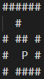

# Run the code

To complie use: `gcc -Wall -Wextra main.c ./labyrinth/labyrinth.c common.c play.c print.c`  
To run use: `./a.exe` or `./a.out`

> Note: After playing with a maze, load a new one to be able to play again.

# Imperatív Programozás Labor ZH

## Elvárások a programmal szemben

- A program végleges verziójának működőképesnek kell lennie. Forduljon és fusson!
- Ne használj globális változókat! Csak a makrók megengedettek!
- Törekedj a szép, áttekinthető kódolásra, használj indentálást, kerüld a kódismétlést!
- Kommunikáljon a program! Legyen egyértelmű a felhasználó számára, hogy mit vár a program, illetve pontosan mi történik!
- Logikusan tagold a megoldást (használj függvényeket, külön fordítási egységeket)!
- Ne foglalj szükségtelenül memóriát, és kerüld a memóriaszivárgást!
- Kerüld a nem definiált viselkedést okozó utasításokat!
- A struktúrák paraméterként átadásánál gondold át, hol érdemes mutatót használni!
- Beadáskor csak a .c, .h és .txt fájlokat kell becsomagolva feltölteni a következő formában: <neptun_kód>.zip

# Egyszerű Labirintus játék

Készíts egy labirintus (útvesztő) játékot.
A labirintus mindig téglalap alakú, egységes beosztással, a szélén folytonos falakkal, melyeken legalább egy nyílás van, hasonlóan a mellékelt ábrához.

A játékos egy véletlenszerű pozícióból indul a labirintus belsejéből, és egy nyílásba (kijárat) kell eljutnia úgy, hogy csak a szabad mezőkön (vagy utakon) haladhat egyesével lépkedve, a falakra nem léphet.
A lehetséges irányok a fel, le, balra, jobbra.
Ha a játékos a kijárat mezőre lépett, akkor megnyerte a játékot.
Feltételezzük, hogy van kijárata a labirintusnak, vannak benne szabad mezők, és bármelyik szabad mezőből el lehet jutni legalább egy kijárathoz.

### Főprogram – main() ( 5 pont )

Elsődleges feladata a program összefogása és kommunikáció a játékossal.

- Köszöntsük a játékost és röviden ismertessük a programot. (Saját szavakkal, pár mondatban elegendő.)
- Ezután egy menü segítségével ajánljuk fel a lehetséges funkciókat a játékosnak, nevezetesen:
  - 1. Kirajzolás – az aktuális labirintus megjelenítése a sztenderd kimenten
  - 2. Készítés – a játékosnak lehetősége van új labirintusok készítésére
  - 3. Mentés – az aktuális labirintus fájlba mentése
  - 4. Betöltés – a korábban fájlba mentett labirintusok betöltése
  - 5. Játék - az aktuális labirintusban elindul a játék
  - 6. Kilépés – a program befejezése
- A program készüljön fel arra is, ha nem létező menüpontot adna meg a játékos.

### 1. Kirajzolás - print_board() ( 5 pont )

- Az aktuális NxM-es labirintust kirajzolja a terminálra, hogy a játékos megtekinthesse.
- A falakat reprezentálja valamilyen tetszőleges karakter (pl.: #, O stb.)
- A szabad mezőket (vagy utakat) hagyjuk üresen (space).
- Az alprogram jelezze a terminálon szövegesen, ha nincs megjeleníthető labirintus, és a program térjen vissza a menübe.

### 2. Készítés - create_labyrinth() ( 15 pont )

- Az alprogram lehetőséget biztosít új pályák (labirintusok) szerkesztésére
- Először is kérje be a játékostól a labirintus dimenzióit (N – sorok, M – oszlopok), melyek az 5-10-es skálán vehetnek fel értékeket.
- Hibás dimenzió érték esetén figyelmeztessük a játékost és ismételjük meg az adat beolvasását.
- Csak az aktuális pálya méreteinek megfelelő mennyiségű memóriát használj fel a labirintust tároló mátrix létrehozásához!
- Tipp: Érdemes a mátrix inicializációját külön alprogramba szervezni.
- Ezután a felhasználó soronként begépelheti a pálya szerkezetét.
- (Feltesszük, hogy a szabályoknak megfelelő pályát generál a felhasználó, nem kell ellenőrizni, elfogadjuk, amit megadott.)

### 3. Mentés - save_labyrinth() ( 5 pont )

- Az aktuális labirintus fájlba mentése.
- Az alprogram bekéri a fájl nevét a felhasználótól, majd kimenti a mátrixban tárolt labirintust a megadott fájlba.
- A fájl első sorába két egész szám kerüljön, melyek a sorok, illetve oszlopok számát jelzik.
- Utána szerepelnek a labirintus sorai.
- Az alprogram jelezze a terminálon szövegesen, ha nincs menthető labirintus és a program térjen vissza a menübe.
- Megjegyzés: A fájlnevek kezelésére használhatsz klasszikus tömböt.

### 4. Betöltés - load_labyrinth() ( 8 pont )

- A játékos által megadott fájlból betölti a mátrixba a labirintust.
- Tipp: Figyelj oda a helyes memóriakezelésre!
- Megjegyzés: A fájlnevek kezelésére használhatsz klasszikus tömböt.

### 5. Játék - play_labyrinth() ( 12 pont )

- Az aktuális labirintus (amennyiben van) belsejében, véletlenszerűen elhelyezi a játékost reprezentáló ’P’ karaktert egy szabad mezőre. (Azaz nem kerülhet falra és nyílásra sem a játékos!)
- A mellékelt ábra egy lehetséges kezdő állapotot mutat.
  
- A játék aktuális állapota jelenjen meg a terminálon induláskor és minden egyes lépés után is.
- A mozgás parancsokat a sztenderd bemeneten keresztül adhatja meg a játékos tetszőleges billentyűk segítségével.
- A játékos 4 szomszédság szerint mozdulhat el az aktuális mezőjéről, azaz fel, le, jobbra, balra (pl.: w, s, a, d), ha nem akadályozza a megadott irányban fal.
- Érvénytelen parancs vagy ütközés esetén ne változzon a játékos pozíciója, a program várja a következő parancsot.
- Legyen lehetősége a játékosnak feladni a játékot egy megadott karakter segítségével (pl.: r).
- Ha a játékos rálép egy nyílásra, akkor megnyerte a játékot.
- Mindkét esetben térjünk vissza a menübe.
